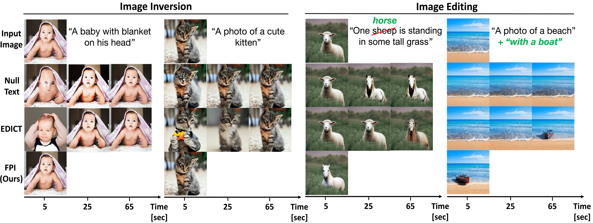

# Fixed-point Inversion for Text-to-image diffusion models

> Barak Meiri, Dvir Samuel, Nir Darshan, Gal Chechik, Shai Avidan, Rami Ben-Ari    
> Tel-Aviv University, Bar-Ilan University, OriginAI, NVIDIA Research

>
>
> Text-guided diffusion models offer powerful new ways to generate and manipulate images. Several applications of these models, including image editing interpolation, and semantic augmentation, require diffusion inversion. This is the process of finding a noise seed that can be used to generate a given image. Current techniques for inverting a given image can be slow or inaccurate. The technical challenge for inverting the diffusion process arises from an implicit equation over the latent that cannot be solved in closed form. Previous approaches proposed to solve this issue by approximation or various learning schemes. Here, we formulate the problem as a fixed-point equation problem and solve it using fixed-point iterations, a well-studied approach in numerical analysis. We further identify a source of inconsistency that significantly hurts the inversion of real images encoded to the latent space. We show how to correct it by applying a prompt-aware adjustment of the encoding. Our solution, Fixed-point inversion, is much faster than previous techniques like EDICT and Null-text, with similar inversion quality. It can be combined with any pretrained diffusion model and requires no model training, prompt tuning, or additional parameters. In a series of experiments, we find that Fixed-point inversion shows improved results in several downstream tasks: image editing, image interpolation, and generation of rare objects.

<a href="https://arxiv.org/abs/2312.12540"></a>

<p align="center">
  
<br>

## Requirements

Quick installation using pip:
```
pip install -r requirements.txt
```

## Usage

To run inversion and editing, you can simply run 'main.py' for real image editing

```
python main.py
```

and 'main_fake.py' for generated image editing.
```
python main_fake.py
```

## Cite Our Paper
If you find our paper and repo useful, please cite:
```
@article{Meiri2023FixedpointIF,
  title={Fixed-point Inversion for Text-to-image diffusion models},
  author={Barak Meiri and Dvir Samuel and Nir Darshan and Gal Chechik and Shai Avidan and Rami Ben-Ari},
  journal={ArXiv},
  year={2023},
}
```
